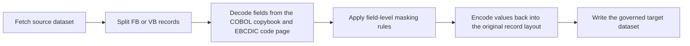

# How Masking Works in ForgeTDM

This document explains ForgeTDM masking at three levels:

1. A short answer for a non-technical audience.
2. The logical workflow used by operators and data owners.
3. The technical execution path used by the application.

It describes masking of database data, mainframe files, and unstructured files. Synthetic data generation is related, but it is a separate process: synthetic generation creates new records, while masking transforms sensitive values from existing records.

## The 30-second, layman explanation

ForgeTDM replaces sensitive information with safe, realistic-looking information before the data is delivered to a test environment.

Think of it as a secure replacement recipe:

- `Yeshpal` can consistently become `Daniel`.
- The same customer number can receive the same safe replacement wherever it appears.
- A credit-card number remains card-shaped and passes its checksum, but it is no longer the original card number.
- A date remains a date, and a city, state, and ZIP code can remain a sensible combination.
- The recipe uses a protected secret, so someone who only has the masked data cannot run the recipe backward to recover the source value.

The result is useful test data without handing testers the original sensitive values.

## A simple example

Assume the source systems contain this customer:

| System | Table or file | Field | Original value |
|---|---|---|---|
| Core banking | `customers` | `customer_id` | `10025` |
| Core banking | `customers` | `first_name` | `Yeshpal` |
| Cards | `card_accounts` | `customer_id` | `10025` |
| Mainframe | `CUST-TRANSACTION` | `CUST-ID` | `10025` |

With compatible rules and the same masking secret and seed, ForgeTDM can turn `10025` into one consistent replacement on every related key. The parent and child records can still join, but the original identifier is not delivered.

The first name can be replaced independently with a realistic value. It does not need to match the key because it belongs to a different logical masking domain.

## Logical masking workflow

```mermaid
flowchart LR
    A["Discover or identify sensitive columns"] --> B["Review and approve classifications"]
    B --> C["Create a masking policy"]
    C --> D["Map source tables and columns to targets"]
    D --> E["Preview and validate the plan"]
    E --> F["Read source rows"]
    F --> G["Mask values in flight"]
    G --> H["Load or update the target"]
    H --> I["Validate results and retain audit evidence"]
```



### 1. Identify what is sensitive

PII Discovery can propose classifications such as name, email, SSN, account number, address, and credit card. A user can review those findings instead of applying every suggestion blindly.

Discovery does not itself modify data. It supplies evidence and recommendations for policy design.

### 2. Define the policy

A masking policy is a governed collection of rules. Each rule identifies:

- schema, table, and column;
- masking function;
- optional function parameters;
- deterministic behavior.

Examples include `FIRST_NAME`, `EMAIL`, `CREDIT_CARD`, `DATE_SHIFT`, `FORMAT_PRESERVE`, `DIRECT_LOOKUP`, `HASH_LOOKUP`, `REDACT`, `NULLIFY`, and a governed `SCRIPT` exit.

Policy and rule references are validated when they are saved and again when a job is prepared. Unknown functions and invalid lookup or numeric parameters are rejected before data movement.

### 3. Define the DataScope and column map

The DataScope says which rows and tables belong in the delivery. The table and column maps decide where each value goes.

A target column can:

- use a masking policy;
- receive a literal value;
- be set to null;
- be suppressed from the target write;
- pass through unmasked when explicitly allowed;
- use a source column whose name differs from the target column.

Conditions can apply an action only to qualifying rows. Conditions can use same-row values and governed join-based lookups.

When a table has its own policy, that policy is used for the table. If it has no applicable table rule, ForgeTDM falls back to the job's default policy.

### 4. Preview and guard the run

Before execution, ForgeTDM resolves the source, target, policy, table profile, relationships, column mappings, load action, and target preparation behavior. Referenced objects are checked against the caller's access scope.

The plan can warn when related key columns are not masked compatibly, because masking only one side of a relationship can break joins.

### 5. Execute the selected masking mode

ForgeTDM supports three main database masking patterns:

| Mode | What happens |
|---|---|
| Mask copy | Rows are read from a source and masked before they are written to a separate target. |
| Subset and mask | A driver and relationship closure select a smaller related data set; selected rows are masked during delivery. |
| In-place mask | Selected columns are updated in the source table itself. The source and target must be the same physical data source and schema. |

The operator also selects the load behavior, such as insert, update, insert/update, replace, or target preparation. Destructive preparation is a separate choice; masking does not implicitly truncate a target.

## Technical explanation

### Core deterministic algorithm

The cryptographic base is HMAC-SHA-256:

```text
digest = HMAC-SHA256(maskingSecret, logicalSalt + separator + normalizedSourceValue)
```

The digest is used to make a deterministic choice or transformation. For example, it can:

- choose a replacement from a controlled dictionary;
- seed a deterministic pseudo-random sequence;
- drive a decimal permutation;
- produce a non-reversible token;
- choose a stable date shift or numeric perturbation.

The secret comes from `FORGETDM_MASKING_SECRET`. An optional job masking seed derives a different effective masking universe:

```text
effectiveSecret = projectSecret + "::seed::" + jobSeed
```

Therefore:

- same secret + same seed + same logical salt + same source value = same result;
- changing the seed or secret changes the result;
- the secret is not stored with the masked value;
- there is no decrypt operation in the masking engine.

Direct lookup is an intentional exception to the stateless HMAC model: it uses an approved source-to-replacement mapping. Anyone who retains that mapping may be able to correlate values, so access to lookup data must be governed.

### Why the logical salt matters

ForgeTDM does not use one salt for every column.

- Semantic functions use canonical salts such as `name.first`, `email`, `ssn`, and `ccn`. This lets the same semantic value map consistently across tables and databases.
- Related PK/FK or tool-defined key columns can share an `ri:` salt derived from their relationship group.
- Other functions normally use a `table.column` salt so two unrelated fields do not accidentally share a masking domain.

Cross-table consistency requires both sides to use compatible masking functions and the same effective secret and seed. ForgeTDM reports inconsistent key masking rather than silently claiming that a broken relationship is safe.

### Row processing sequence

For a database copy or subset job, the service performs this sequence:

1. Resolve and authorize the source, target, DataScope, profiles, policies, and referenced objects.
2. Read source and target metadata.
3. Build a target-column plan from the column map.
4. Remove suppressed columns from the write plan.
5. Build the effective rule map and relationship-consistency salts.
6. Stream source rows using JDBC fetch windows rather than loading the whole table into Java heap.
7. Put all original values for the current row into a `MaskContext`.
8. Evaluate row conditions.
9. Apply literal, null, passthrough, or masking actions.
10. Store already-masked sibling values in the row context for composite rules and scripts.
11. Convert the output to the target JDBC datatype.
12. Write rows in dialect-aware batches and commit according to the load plan.
13. Update table and row progress, support cancellation, and retain failure diagnostics.

The important security property is that a mask-copy job transforms a value before that value is written to the target. The unmasked row is not first copied to the target and updated later.

### Row context and coherent values

`MaskContext` contains:

- original values for the current row;
- already-masked sibling values;
- a stable row index;
- a shared date-shift range when a row needs related dates to move together.

This supports rules such as:

- building an email from masked name components;
- composing `last_name, first_name` with a governed script;
- masking phone, SSN, or date values split across multiple columns;
- dispatching a function based on another column's indicator;
- applying one compatible date shift across related date fields.

Rule order matters when a script intentionally reads an already-masked sibling. The column plan must make the dependency explicit and should be previewed before launch.

### Function behavior

Masking is not just random text replacement. Each function has a contract.

| Function family | Technical behavior |
|---|---|
| Dictionary substitution | A keyed digest selects a stable replacement from a controlled name, company, or custom list. |
| Format preserving | Letters remain letters, digits remain digits, case and punctuation can be retained. |
| Credit card | A keyed decimal permutation masks the PAN, preserves the selected card domain, and calculates a valid Luhn check digit. Distinct valid PANs remain distinct within the selected mode/domain. |
| Dates | Values can receive a deterministic bounded shift, retain an age band, or receive a fixed Optim-style age movement. |
| Geographic | US address and city/state/ZIP functions select coherent test combinations. |
| Financial identifiers | Account, IBAN, SWIFT/BIC, and ABA functions preserve required shape or checksum rules. |
| Tokenization | An irreversible HMAC-derived token is emitted with configurable prefix and length. |
| Lookup | Direct lookup uses explicit pairs; hash lookup assigns source hashes to controlled rows; secure lookup chooses from an approved list. |
| Redaction | All or part of a value is hidden without trying to create realistic replacement data. |
| Script | A saved, sandboxed Lua exit handles approved business-specific composition or transformation. |

Most transformation functions pass null or empty source values through unchanged. `NULLIFY`, `FIXED`, `SEQUENCE`, lookup functions, and `SCRIPT` have explicit behavior and are evaluated separately.

### Database pushdown and fallback

Java masking is the portable reference implementation. A PostgreSQL in-place path can push a limited set of single-pick functions into the database. ForgeTDM installs temporary helpers and performs a Java-versus-database parity check before using them.

If the database function is unsupported or parity cannot be proven, ForgeTDM falls back to the Java path. Multi-draw and more complex functions are not treated as pushdown-safe merely for speed.

### Datatype and database handling

The transformed string is coerced back to the target column type where applicable, including numeric, date, time, timestamp, and boolean values. Loading is dialect aware for PostgreSQL, Oracle, SQL Server, DB2, MySQL, H2, and supported compatible engines.

Batch sizes are reduced where a database has a bind-parameter limit. LOB values are handled without retaining a batch of open source locators. Constraint failures capture bounded original-versus-masked diagnostics for the failed batch; secrets are not written into those diagnostics.

## Mainframe file masking

Mainframe masking uses the same deterministic engine but a different record reader:



The copybook supplies field boundaries and numeric/text encoding. ForgeTDM overlays masked values into those fields, preserving the record organization, LRECL, and selected code page. Jobs expose progress and cancellation and write audit events.

## Unstructured file masking

Unstructured profiles contain selectors, regular expressions, PII types, masking functions, and parameters.

- TXT, LOG, CSV, TSV, JSON, XML, and HTML are parsed and rebuilt in their native structure.
- PDF, Office, RTF, EPUB, email, archives, and other Tika-readable inputs are converted to a safe text-only masked output.
- Image-only, encrypted, audio, or video content fails closed unless an approved extraction service is configured.
- Credit-card detections receive a Luhn check before replacement.
- Unsafe or pathological regular expressions are rejected when a profile is saved.

ForgeTDM does not label an unchanged unsupported binary as masked.

## Security, governance, and evidence

Masking execution is surrounded by controls rather than being only a transformation function:

- policy, source, target, and job visibility is checked against the caller;
- invalid object references are rejected before an asynchronous worker starts;
- maker-checker approval can gate governed launches;
- job status, progress, cancellation, failures, and terminal outcomes are retained;
- policy and rule changes produce audit events;
- validation can check leaks, formats, referential integrity, and unsafe domains.

The masking secret must be managed like a production credential. Do not commit it, print it, include it in evidence, or rotate it casually. Rotating it intentionally changes deterministic outputs and can make separately masked environments inconsistent.

## What masking does not automatically guarantee

1. **Every function is not one-to-one.** Dictionary replacement and redaction can create duplicate values. Use a key-safe or permutation-based rule where uniqueness is required, and validate the target constraint.
2. **Passthrough is not masking.** `PASSTHROUGH`, an explicit no-policy choice, or a condition that evaluates false leaves the original value unchanged by design.
3. **Direct lookup is only as private as its mapping.** Govern and retain the lookup table appropriately.
4. **In-place masking destroys the original values in that table.** It requires backups, tested keys, collision analysis, and explicit operational approval.
5. **Masking does not fix an incorrect table map.** A wrong source-to-target mapping can still produce semantically wrong data even if each value is masked.
6. **Consistency is configuration-dependent.** Related columns need compatible rules, relationship metadata, and the same effective secret and seed.
7. **Validation is still required.** A successful load means the job executed; post-mask validation proves whether the delivered data meets the intended privacy and quality contract.

## Recommended answer for a team discussion

> ForgeTDM reads approved source rows, applies governed column rules before writing them to the target, and derives repeatable replacements using HMAC-SHA-256 plus a logical field salt. That gives the same safe replacement wherever a related value must remain consistent, while format-aware functions keep cards, dates, addresses, and identifiers usable for testing. The process supports copy, subset, in-place, mainframe, and unstructured-file paths, and records progress, validation, and audit evidence. It is masking rather than encryption: the normal engine has no decrypt path, although controlled direct-lookup mappings must be governed separately.

## Implementation reference

The primary implementation is in:

- `src/main/java/io/forgetdm/core/util/Determinism.java`
- `src/main/java/io/forgetdm/core/mask/MaskingEngine.java`
- `src/main/java/io/forgetdm/core/mask/MaskFunction.java`
- `src/main/java/io/forgetdm/core/mask/MaskContext.java`
- `src/main/java/io/forgetdm/policy/PolicyController.java`
- `src/main/java/io/forgetdm/provision/ProvisioningService.java`
- `src/main/java/io/forgetdm/provision/DbMaskPushdown.java`
- `src/main/java/io/forgetdm/mainframe/MainframeMaskingService.java`
- `src/main/java/io/forgetdm/unstructured/UnstructuredMaskingService.java`

Lookup-specific configuration is documented in `docs/masking-lookups.md`.
